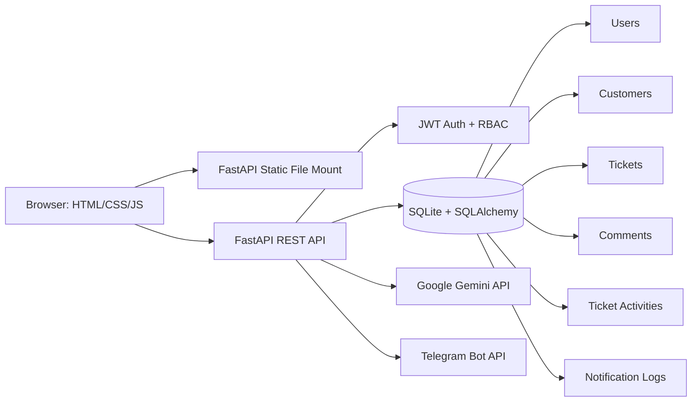
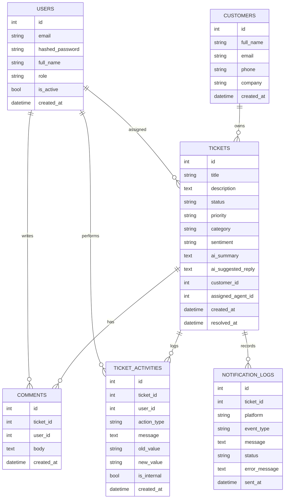

# AI-Enhanced CRM & Ticket Management System

## 1. Cover Page

**Project Title:** AI-Enhanced CRM & Ticket Management System  
**Course Name:** ______________________________  
**Instructor:** ______________________________  
**Submission Date:** May 25, 2026  

**Team Members**

| Name | Student ID | Responsibility |
|---|---|---|
| ____________________ | ____________________ | Backend APIs, database, RBAC |
| ____________________ | ____________________ | Frontend pages, UI testing, screenshots |
| ____________________ | ____________________ | AI integration, Telegram, report/demo |

> **Screenshot to insert:** `docs/screenshots/01_login.png`  
> Caption: Login page showing manager and agent demo credentials.

## 2. Executive Summary

The AI-Enhanced CRM & Ticket Management System is a web-based support platform inspired by Zendesk and Freshdesk. It allows support agents and managers to manage customer records, create and track support tickets, maintain ticket communication history, view dashboards, use Gemini AI for support workflows, and send Telegram notifications for important events.

The project satisfies the assignment requirements by providing persistent storage, secure authentication, role-based access control, customer management, ticket management, activity logs, dashboards, real AI features, and real messaging integration. The application is intentionally built with a simple university-project stack: FastAPI, SQLite, SQLAlchemy, HTML, CSS, and vanilla JavaScript. This keeps the project easy to run, inspect, explain in viva, and extend.

The final demo should be recorded with real Gemini and Telegram keys configured. Development fallback mode is included only so the system remains usable when secrets are not available.

## 3. Project Objectives

The main objectives were:

- Build a mini CRM where managers and agents can log in securely.
- Allow managers to manage customer data and agent accounts.
- Allow tickets to be created, assigned, filtered, updated, resolved, and closed.
- Maintain a full ticket timeline containing comments, status changes, priority changes, assignments, AI actions, and notifications.
- Show customer profile pages with full ticket and communication history.
- Use Google Gemini inside real workflows, not as a separate toy feature.
- Send Telegram messages to a real account/channel and persist delivery logs.
- Provide a dashboard and reports for managerial decision-making.
- Keep the application simple enough to be presented and defended in a student viva.

## 4. Technology Stack

| Layer | Technology | Reason |
|---|---|---|
| Backend | FastAPI | Lightweight Python API framework with automatic OpenAPI docs |
| Database | SQLite | Persistent local database, easy setup for demos |
| ORM | SQLAlchemy | Structured model definitions and database queries |
| Authentication | JWT + bcrypt | Secure token login and hashed passwords |
| Frontend | HTML/CSS/Vanilla JS | No build step, easy static serving |
| AI | Google Gemini | Categorization, sentiment, summaries, reply suggestions |
| Messaging | Telegram Bot API | Real external message delivery |
| Charts | Chart.js | Dashboard visual indicators |
| Testing | pytest + FastAPI TestClient | Automated backend regression checks |

## 5. System Architecture



The frontend calls `/api/...` endpoints using a shared fetch wrapper that attaches the JWT bearer token. FastAPI validates the token, checks the role, executes database operations through SQLAlchemy, and optionally calls Gemini or Telegram services.

Managers can see and manage all records. Agents can see unassigned tickets and tickets assigned to them, add notes, and update permitted ticket information.

> **Screenshot to insert:** `docs/screenshots/02_dashboard_manager.png`  
> Caption: Dashboard showing summary cards, status chart, priority chart, and workload section.

## 6. Authentication and Role-Based Access Control

The system uses bcrypt password hashes and JWT access tokens. The seeded demo users are:

| Role | Email | Password |
|---|---|---|
| Manager | `admin@test.com` | `admin123` |
| Agent | `agent@test.com` | `agent123` |

Backend dependencies enforce access:

- `get_current_user`: validates JWT and active user status.
- `require_manager`: restricts manager-only endpoints.
- `require_agent_or_manager`: validates recognized application roles.
- Ticket access helper: prevents agents from accessing other agents' assigned tickets.

Manager-only capabilities include deleting customers, assigning tickets, viewing notification logs, sending test notifications, viewing reports, and managing users.

## 7. Database Schema



### Table Explanations

`users` stores login accounts, roles, active status, and bcrypt password hashes.  
`customers` stores CRM contact details such as name, email, phone, and company.  
`tickets` stores support issues, status, priority, AI category/sentiment, summaries, suggested replies, and assignment.  
`comments` stores agent and manager notes on tickets.  
`ticket_activities` stores the full changelog, including ticket creation, comments, status changes, priority changes, assignment changes, AI updates, and notification actions.  
`notification_logs` stores Telegram delivery attempts with sent, failed, or skipped status.

## 8. Customer Management

Managers can create, edit, view, and delete customers. Agents can view customers to link tickets but cannot perform destructive customer actions. The customer profile page shows:

- Customer name, email, phone, company, and date added.
- Full ticket history.
- Latest ticket status, priority, category, and sentiment.
- Communication and activity history across all tickets.
- Direct links to each ticket detail page.

> **Screenshot to insert:** `docs/screenshots/03_customers.png`  
> Caption: Customer list with search and profile action.

> **Screenshot to insert:** `docs/screenshots/04_customer_profile.png`  
> Caption: Customer profile showing full ticket history and communication timeline.

## 9. Ticket Management

Tickets can be created with a title, description, customer, priority, and optional assigned agent. Ticket list filters include:

- Status
- Priority
- Assigned agent
- Date from
- Date to
- Search text

Ticket detail pages show the description, customer, status, priority, AI category, AI sentiment, AI summary, AI reply suggestion, and a full activity timeline.

The activity timeline records:

- Created
- Comment/internal note
- Status change
- Priority change
- Assignment change
- AI update
- Notification

> **Screenshot to insert:** `docs/screenshots/05_tickets_filters.png`  
> Caption: Tickets list with status, priority, agent, date, and search filters.

> **Screenshot to insert:** `docs/screenshots/06_ticket_detail_timeline.png`  
> Caption: Ticket detail page with AI fields and full activity timeline.

## 10. Dashboard and Reports

The dashboard provides summary statistics and visual indicators:

- Total tickets
- Open tickets
- In progress tickets
- Resolved today
- Critical tickets
- Unassigned tickets
- Tickets by status chart
- Tickets by priority chart

Managers see agent-wise workload data, including open count, in-progress count, critical count, and total assigned. Agents see their own assigned open/in-progress tickets.

The reports page provides manager-level breakdowns by category, status, priority, agent performance, average resolution time, and recent resolved tickets.

> **Screenshot to insert:** `docs/screenshots/12_reports.png`  
> Caption: Manager reports page with category/priority charts and agent performance table.

## 11. AI Integration

Google Gemini is integrated into real ticket workflows.

### 11.1 Ticket Categorization and Sentiment

On ticket creation, the backend sends the title and description to Gemini and asks for strict JSON:

```json
{
  "category": "billing",
  "sentiment": "frustrated"
}
```

The system validates the returned category and sentiment before saving. Accepted categories are `billing`, `technical`, `account`, `shipping`, and `general`. Accepted sentiments are `positive`, `neutral`, `negative`, and `frustrated`.

> **Screenshot to insert:** `docs/screenshots/07_ai_category_sentiment.png`  
> Caption: Ticket detail showing AI category and sentiment after ticket creation.

### 11.2 AI Reply Suggestion

Agents can generate a professional response draft using ticket title, description, customer name, comments, category, sentiment, status, and priority. The latest suggestion is saved in the ticket and can be copied into the comment box.

> **Screenshot to insert:** `docs/screenshots/08_ai_reply_suggestion.png`  
> Caption: AI-generated reply suggestion displayed on the ticket detail page.

### 11.3 AI Resolution Summary

When a ticket is marked resolved, Gemini generates a concise summary and stores it in `ai_summary`. This summary remains visible without another API call.

> **Screenshot to insert:** `docs/screenshots/09_ai_summary_resolved.png`  
> Caption: AI resolution summary saved after changing ticket status to resolved.

### 11.4 AI Escalation

The system checks whether a frustrated or urgent ticket should be escalated. If recommended, priority can be upgraded and the activity timeline records the reason. Critical escalation can also trigger a Telegram notification.

### 11.5 Error Handling

If `GEMINI_API_KEY` is missing or Gemini fails, the app stores safe fallback values. This is useful for development, but the final recorded demo should use a real key and show real AI output.

## 12. Messaging Integration

Telegram Bot API is used for real external notifications. Notifications are triggered for:

- New ticket created
- Critical ticket created or escalated
- Ticket resolved
- Manual test notification from the manager-only integration/notification pages

Every attempt is stored in `notification_logs` with:

- Platform
- Event type
- Message
- Status: `sent`, `failed`, or `skipped`
- Error message if available
- Sent timestamp

If Telegram is missing, the notification is logged as skipped and the application continues running.

> **Screenshot to insert:** `docs/screenshots/10_notifications.png`  
> Caption: Notification log showing sent/skipped/failed Telegram attempts.

> **Screenshot to insert:** `docs/screenshots/13_telegram_received_message.png`  
> Caption: Real Telegram chat/channel showing a received CRM notification.

## 13. Integration Health Check

A manager-only Integration Health Check page verifies final-demo readiness:

- Gemini configured or missing
- Telegram configured or missing
- Test AI categorization and sentiment output
- Test Telegram message delivery

This page never displays secret values. It only shows configured/missing status and generated test results.

> **Screenshot to insert:** `docs/screenshots/11_integration_health.png`  
> Caption: Integration Health Check page after real Gemini and Telegram keys are configured.

## 14. Testing

Automated tests are included in `backend/tests/test_core.py`. They verify:

- Login returns a JWT token.
- Customer CRUD works.
- Ticket creation stores AI fallback category/sentiment and activity.
- Dashboard stats endpoint works.

Run tests:

```powershell
cd backend
pytest
```

Manual QA steps are documented in `docs/QA_CHECKLIST.md` and should be completed before submission.

## 15. Security and Submission Hygiene

The project avoids committing secrets and generated files. `.gitignore` excludes:

- `.env`
- `*.db`
- `crm.db`
- `venv/`
- `__pycache__/`
- `.pytest_cache/`
- `node_modules/`

Passwords are stored using bcrypt hashes. JWT tokens are required for protected APIs. Manager-only frontend links are hidden from agents, and backend endpoints also enforce manager-only access.

## 16. Challenges and Learnings

The main challenge was making the application complete without over-engineering it. Role-based access had to be enforced on the backend, not only hidden in the UI. AI and Telegram integrations also needed graceful fallback behavior so the app could run in a development environment while still supporting a real final demo.

Key learnings:

- External service integration must be observable through logs and health checks.
- Activity timelines are more useful than comments alone because they explain how a ticket changed.
- Storing AI outputs is important for auditability and repeatability.
- Backend RBAC is necessary even when the frontend hides buttons.
- A submission needs documentation, QA evidence, screenshots, and cleanup checks, not only working code.

## 17. Work Division

| Member | Work |
|---|---|
| ____________________ | FastAPI routers, database models, authentication, RBAC |
| ____________________ | Frontend pages, dashboard, reports, responsive UI |
| ____________________ | Gemini prompts, Telegram setup, test evidence, report |

## 18. Final Demo Script

1. Open the login page and log in as manager.
2. Open Integration Health Check and show Gemini/Telegram configured.
3. Send test Telegram message and show the real Telegram chat.
4. Create a customer.
5. Create a ticket for that customer.
6. Show AI category and sentiment on the ticket detail page.
7. Assign the ticket to an agent.
8. Add an internal note.
9. Change priority to critical and show notification log/Telegram message.
10. Generate AI reply suggestion.
11. Resolve the ticket and show saved AI summary.
12. Open customer profile and show ticket history.
13. Open dashboard, reports, users, and notification log.
14. Log in as agent and show restricted view.

## 19. References

- FastAPI documentation: https://fastapi.tiangolo.com/
- SQLAlchemy documentation: https://docs.sqlalchemy.org/
- Pydantic documentation: https://docs.pydantic.dev/
- Google Gemini documentation: https://ai.google.dev/
- Telegram Bot API documentation: https://core.telegram.org/bots/api
- Chart.js documentation: https://www.chartjs.org/docs/latest/
